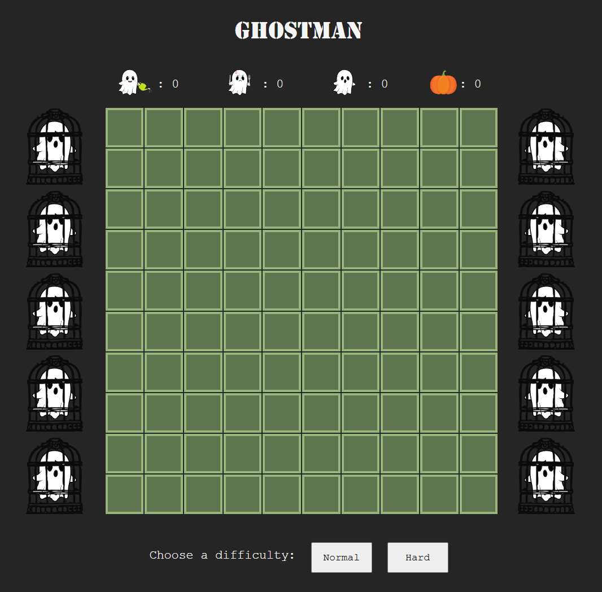
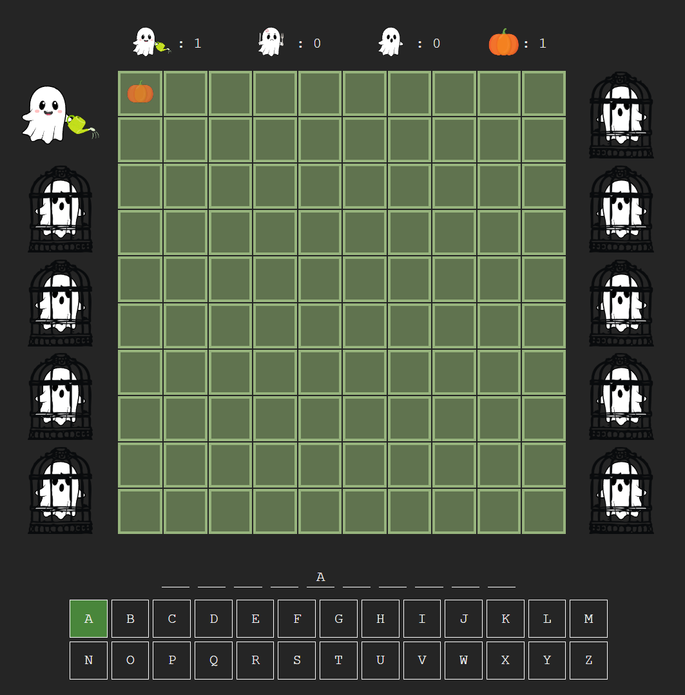
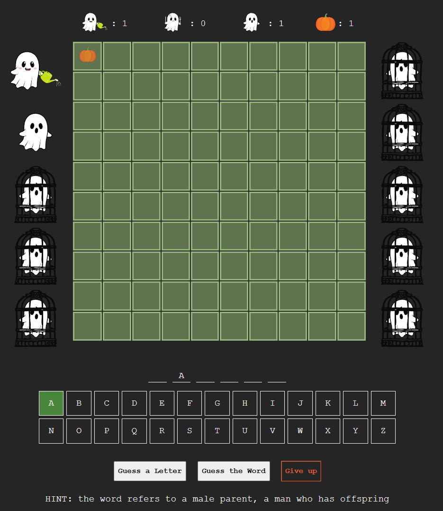

# Ghostman

This project is a halloween version of the classic hangman game.

1. <a href="#introduction">Introduction</a>
2. <a href="#scoring-system">Scoring system</a>

## Introduction
You own a pumpkin patch, and there are 10 ghosts, each locked in a cage beside your patch.

  

You take turns guessing an unknown word. 

   

1. If you guess the whole word or a letter correctly, you free <em>"happy ghosts"</em> which water your patch and grow pumpkins.   

   

2. If you guess a letter or the word incorrectly, <em>"angry ghosts"</em> break out of their cages, and eat the pumpkins from your patch.  

3. You can choose to use a hint or give up, in which case you will free the <em>"neutral ghosts"</em> which will neither grow pumpkins nor eat the ones in your patch.  

   

4. NOTE: Your patch is small, so you can only grow a maximum of 100 pumpkins at a time. Once you have filled the patch, you can harvest all 100 pumpkins, and restart the game.  

You can see the total number of ghosts you have made happy, angry and neutral, and number of pumpkins you have grown altogether at the top of the screen.

## Scoring system
1. If you guess a letter correctly: +1 pumpkin   

2. If you guess a letter incorrectly: -1 pumpkin   

3. If you guess the word correctly: +2 pumpkin for each remaining ghost   

4. If you guess the word incorrectly: -1 pumpkin for each remaining ghost   

5. In HARD mode: +2 pumpkins bonus (AND +1 for each correct letter OR +2 for each remaining ghost when word is correctly guessed)   